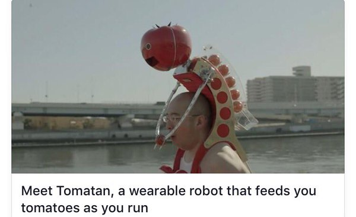

class:
background-image: url(img/s0.jpg)

---
name: about
class: left
background-image: url(img/about.jpg)

.right-column[

Open Minded

|> Science

|> Craftsman

.footnote[
<i class="fa fa-github-square fa-2x"></i> [cmg-dev](https://github.com/cmg-dev)

<i class="fa fa-twitter-square fa-2x"></i> [@codethonian](https://twitter.com/codethonian)
]
]

???
Coder in natural Environment

---
name: motivation
class: left
background-image: url(img/motivation.jpg)

.regular[
# Motivation
]

.footnote[
**Read the** [Paper](http://www-01.ibm.com/common/ssi/cgi-bin/ssialias?infotype=PM&subtype=XB&htmlfid=GBE03620USEN)
]
???

---
name: motivation
class: left
background-image: url(img/motivation_elixir.jpg)

.regular[
# Elixir
]

---
name: iot
class: center, middle
background-image: url(img/iot.jpg)

.heading[
# Meet the IoT
]

---
name: iot
class: left
background-image: url(img/iot_development.jpg)

.regular[
## Forecast
]
.right-column[

Device democracy will emerge,

... after rebooting the IoT
]

.footnote[
[[1](http://www-01.ibm.com/common/ssi/cgi-bin/ssialias?infotype=PM&subtype=XB&htmlfid=GBE03620USEN)]
]

???
Why the IoT already needs a reboot:

* First wave of the IoT; focused on very high-value applications

    jet engines, automated smart meters and remote healthcare management

* Demand has been slow
* Only **30 percent** of heavy industrial equipment is networked
* Only **10 percent** of smart TVs are used for Internet viewing

* consumers have failed to embrace devices from smart toothbrushes to refrigerators.

* Enterprises and entrepreneurs treating the IoT as if it were **just another** computing platform
* Applying the same set of business models, services, ecosystems, applications and analytic.

---
name: iot
class: left
background-image: url(img/iot_comparison.jpg)

.regular[
## Worlds Collide
]

.footnote[
[[2](http://www-01.ibm.com/common/ssi/cgi-bin/ssialias?infotype=PM&subtype=XB&htmlfid=GBE03620USEN)]
]

???
* The application of old world approaches to this field

* Apply "as a Service" does not increase product quality

* IOT isn't new

---
name: iot
class: left
background-image: url(img/iot_problems.jpg)

.regular[
]

???
1. High costs
2. Broken Buisiness Models
3. Trust
4. Not Future Proof
5. Function

Why the IoT already needs a reboot:

* First wave of the IoT; focused on very high-value applications

    jet engines, automated smart meters and remote healthcare management

* Demand has been slow
* Only **30 percent** of heavy industrial equipment is networked
* Only **10 percent** of smart TVs are used for Internet viewing

* consumers have failed to embrace devices from smart toothbrushes to refrigerators.

* Enterprises and entrepreneurs treating the IoT as if it were **just another** computing platform
* Applying the same set of business models, services, ecosystems, applications and analytic.

---
name: iot
class: left
background-image: url(img/mr_tomatan.jpg)

.regular[
## Use Cases


]

.footnote[
<i class="fa fa-twitter-square fa-2x"></i> [@Internet of Shit](https://twitter.com/internetofshit)
]
---
name: iot
class: left
background-image: url(img/iot_design_rules.jpg)

.regular[
## Design Rules
]

.footnote[
[[3](http://www-01.ibm.com/common/ssi/cgi-bin/ssialias?infotype=PM&subtype=XB&htmlfid=GBE03620USEN)]
]

---
name: iot
class: left
background-image: url(img/iot.jpg)

.right-column[

**IBM's conclusion**

``` plain
"This first report of our study shows that a low-cost,
private-by-design “democracy of devices” will emerge
that will enable new digital economies and create new
value, while offering consumers and enterprises
fundamentally better products and user experiences."
```

Well, and how?
]

.footnote[
[[4](http://www-01.ibm.com/common/ssi/cgi-bin/ssialias?infotype=PM&subtype=XB&htmlfid=GBE03620USEN)]
]

???
* End of chapter 1

---
name: nerves
class: left
background-image: url(img/electronics_1_rpi_vs_ardiuno_0.jpg)

---
name: nerves
class: left
background-image: url(img/electronics_1_rpi_vs_ardiuno_1.jpg)

---
name: nerves
class: left
background-image: url(img/electronics_1_rpi_vs_ardiuno_2.jpg)

---
name: nerves
class: left
background-image: url(img/embedded_linux_is_pain.jpg)

---
class: left
background-image: url(img/electronics_0_nerves-vs-raspbian.jpg)

.right-column[
]

---
class: left
background-image: url(img/electronics_1_partitioning.jpg)

.right-column[
]

---
name: elixir
class: left
background-image: url(img/motivation_elixir.jpg)

.regular[
## Quo vadis, Elixir?

```elixir
  Functional
  |> Concurrent
  |> Pragmatic
  |> Fun
```
]

---
name: elixir
class: left
background-image: url(img/elixir.jpg)

.regular[
## Elixir <3 Embedded

*  Fault Tolerant

*  Concurrent

*  Fast Garbage Collection

*  Constraint Hardware

*  Binary Protocols
]
---
name: nerves
class: left
background-image: url(img/nerves_intro0.jpg)

---
name: nerves
class: left
background-image: url(img/nerves_intro.jpg)

.footnote[
<i class="fa fa-rocket fa-2x"></i> [Homepage](http://nerves-project.org/)

<i class="fa fa-twitter-square fa-2x"></i> [@NervesProject](http://twitter.com/NervesProject)

<i class="fa fa-github-square fa-2x"></i> [Contribute!](https://github.com/nerves-project)
]

???
platform

Using a lean, custom cross-compiled linux, nerves boots directly to the battle hardened BEAM VM, starting your application in seconds.

framework

Most devices need to get on a network, get discovered, update firmware, and deal with I/O of various kinds. You're not on your own.

tooling

Cross-compliation can be a total drag. Our tools make it smooth as silk. Go from "mix new" to running code on your device in minutes.

---
name: nerves
class: left
background-image: url(img/nerves_features.jpg)

.regular[

]

---
name: nerves
class: left
background-image: url(img/nerves_targets.jpg)

.regular[

]

---
class: left
background-image: url(img/nerves_build.jpg)

.right-column[
]

---
name: inverse
class: left
background-image: url(img/bakeware_1.jpg)

.right-column[
# Bakeware

**a tool and service to build your cross compiled firmware**

Configure, compile and share systems,
toolchains and firmware

Find it [here](http://www.bakeware.io/)
]

---

name: inverse
class: left, middle
background-image: url(img/extinct.jpg)

.example_page_left[
# Bakeware's gone

**Good News!**

**Everythong is now integrated into ```mix```...**

]

---
name: inverse
class: left
background-image: url(img/extinct.jpg)

.example_page[
# Using mix

**Start a project**

```elixir
$ mix nerves.new my_project --target rpi3
```

**Does the boilerplate**

```elixir
creating my_project/config/config.exs
creating my_project/lib/my_app.ex
creating my_project/test/test_helper.exs
creating my_project/test/my_app_test.exs
creating my_project/rel/vm.args
creating my_project/rel/.gitignore
creating my_project/.gitignore
creating my_project/mix.exs
creating my_project/README.md
```
]

---
name: inverse
class: left
background-image: url(img/extinct.jpg)

.example_page[
**Compile**

```elixir
$ mix compile
Nerves Precompile Start
...
Compile Nerves toolchain
Downloading from Github Cache
Unpacking toolchain to build dir
...
Generated nerves_system_rpi3 app
[nerves_system][compile]
[nerves_system][http] Downloading system from cache
[nerves_system][http] System Downloaded
[nerves_system][http] Unpacking System
...
Nerves Env loaded
Nerves Precompile En
```
]

---
name: inverse
class: left
background-image: url(img/extinct.jpg)

.example_page[
**Create Firmware**

```elixir
$ mix firmware
Nerves Env loaded
Nerves Firmware Assembler
...
Building _images/rpi3/my_project.fw...

$ mix firmware.burn
Burn rpi3-0.0.1 to SD card at /dev/rdisk3, Proceed? [Y/n]
```
]

---
name: demo
class: left
background-image: url(img/solo_0.jpg)

.left-column[
# Livecoding Fun

**Demo time...**
]

???

* More Doing less talking

* Lots of demos on the internet

1. nerves-io-led

---
name: inverse
class: left
background-image: url(img/elixir_nerves_phonix.jpg)

.example_page[
]

---
name: video
class: left
background-image: url(img/tv1.jpg)

.regular[
<i class="fa fa-youtube-play fa-2x"></i> [Embedded Elixir in Action](https://www.youtube.com/watch?v=kpzQrFC55q4)

<i class="fa fa-youtube-play fa-2x"></i> [Getting Started with Nerves](https://www.youtube.com/watch?v=kWXrct6nnGg)

<i class="fa fa-youtube-play fa-2x"></i> [SumoBots!](https://www.youtube.com/watch?v=tCg1LakJF3g&index=6&list=PLA9E5Lsig6GTBPb2BRf_2ONIcnRTU5Iy0)

<i class="fa fa-youtube-play fa-2x"></i> [Elixir with Nerves](https://www.youtube.com/watch?v=kJYHzxIh_Yc)
]
